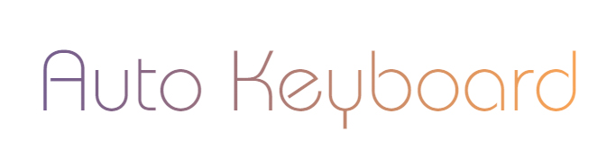

# auto-keyboard



## 概要

这是一个半自动化的键盘访问解决方案，主要适用于需要完全键盘操作场景，比如大屏展示，电视，游戏菜单等，大大简化按键操作的逻辑。

焦点使用虚拟焦点，也就是通过添加`.focus`等class实现，而不是原生自带的`:focus`，更利于定制化需求。

基于`HTML`页面。

> 比较冷门，键盘交互方向，不感兴趣的可以跳过。

## 特点

模块化编程方式

统一的按键处理

统一的滚动动画

[马上体验](http://xboxyan.codelabo.cn/auto-keyboard/example/index.html)

## 快速入门

由于实际场景复杂多样，过于全反而会让业务代码更繁杂，不可维护。

该功能插件仅针对于局部实现自动化操作，整体页面布局仍需开发者手动协调。

具体是指开发者需要手动将页面分为几块逻辑区域，比如下方的键盘区和搜索列表区。

然后对每块区域分别调用`new View()`，每一块区域的逻辑互不干扰，可独立开发。

```html
<link href="./css/view.css" type="text/css" rel="stylesheet">
<div class="search_keyborad" id="search">
    <a data-key="A">A</a>
    <a data-key="B">B</a>
    <a data-key="B">C</a>
    ...
</div>
<ul class="search_list" id="list">
    <li class="search_item">
        
        <h3>11人类DNA密码破译</h3>
    </li>
    <li class="search_item">
        
        <h3>22人类DNA密码破译</h3>
    </li>
    ...
</ul>
<script type="text/javascript" src="./js/smoothscroll.min.js"></script>
<script type="text/javascript" src="./js/view.js"></script>
```

```js
var S = $('search');	
var L = $('list');
var V = new View(S);
var Vl = new View(L);
V.init(S.getElementsByTagName('a'));
Vl.init(L.getElementsByTagName('li'));
V.onfocus();
```

这样，每块区域的按键都已经自动适配了。

然后针对每块区域的关联适当写一些逻辑即可。

## 概念

**区域** 指一块包含可获焦同类型同功能一类元素的集合，通过 `new View(container)`创建。

**元素** 指区域里面每一个可以获焦的节点。

## API

通过`new View(#container)`适配的区域，可获焦元素可以是常见的`n*m`分布，也可以是绝对定位的任意布局。

通过`V.init(children)`来初始化可获焦子元素，传入`nodeList`即可，与页面层级无关。

### new View(container)

核心方法。创建一个区域，传入参数为页面的一个容器。

```js
var con = document.getElemetById('con');
var V = new View(con);
```

如果不传`container`，可创建一个虚拟的区域，你可以进入该区域进行其他操作，比如悬浮窗，视频播放等等。

该方法通常只需加载一次。

### V.init(nodeList)

初始化，传入参数为需要获焦的子元素，通常使用`getElementsByTagName`来一次性传入多个。

也可以通过数组形式传入特定的子元素，如下。

```js
var child = [ nodeA,nodeB,nodeC ];
V.init(child)
```

目的是能够完全控制子元素，因为有些情况下子元素可能不在同一层级。比如下方的`a`元素

```html
<div id="con">
    <a></a>
    <div>
        <span></span>
        <a></a>
        <a></a>
    </div>
    <a></a>
</div>
```

该方法需要等待页面加载完全后使用（需要获取元素的位置关系），也就是说当动态加载网络数据时，需等待只元素加入容器之后调用

```js
V.init(S.getElementsByTagName('a'));

//动态数据
ajax({
    url:'XXX',
    sunccess:function(data){
        var html = '';
        for(var i=0;i<data.length;i++){
            html+='<a>'+data[i]+'</a>';
        }
        S.innerHTML = html;
        V.init(S.getElementsByTagName('a'));
    }
})
```

可以传空。此时表示该区域里面没有可获焦元素，常见场景为新闻类，此时该区域可以自动实现上下浏览的功能。

该方法通常只需加载一次，如果是翻页加载数据，可以重新执行。

### V.insertAfter(nodeList)

向后追加子元素。常见场景为上拉加载，追加下一页等功能。

```js
ajax({
    url:'XXX',
    sunccess:function(data){
        var div = document.createElement("div");
        var html = '';
        for(var i=0;i<data.length;i++){
            html+='<a>'+data[i]+'</a>';
        }
        div.innerHTML = html;
        M.appendChild(div);
        V.insertAfter(M.getElementsByTagName('a'));
    }
})
```

注意：追加元素时采用`M.appendChild(node)`方式，不要采用`M.inderHTML+=html`，因为

```js
M.inderHTML += html;

//等效于

M.inderHTML = M.inderHTML + html;
```

会清空原有元素的状态。

### V.insertBefore(nodeList)

与`insertAfter`相反，向前追加子元素。

### V.onfocus()

主动聚焦，当有多个区域时，可选择控制。(区域)

```js
var V = new View(S);
V.onfocus();
```

一个页面只有一个区域可以获焦，当一个区域获焦时，上一个区域会自动失去焦点。

> 获焦的区域，容器会增加`focus`样式，通常在由子元素情况下，不会给容器增加额外样式，在没有子元素情况下，比如新闻浏览时，可以给容器加一个`focus`样式，以表示该区域正在获焦。

**默认焦点**

`autofocus`指定默认焦点，默认为该区域左上角的元素（有可能不是第`0`个，如绝对定位的情况）

给元素指定`autofocus=true`可以在初始化自动聚焦到该焦点。(DOM)

```html
<div>
    <a></a>
    <a autofocus="true"></a>
    <a></a>
    <a></a>
</div>
```

### V.focusById(id)

根据元素`id`聚焦，如果页面可滚动，则会自动定位到该元素。(元素)

### V.focusByIndex(index)

根据元素`index`聚焦，如果页面可滚动，则会自动定位到该元素。(元素)

这里的`index`指的是元素在文档中相对于其他子元素的顺序。

```html
<div>
    <a></a> <!--0-->
    <div>
        <span></span>
        <a></a>  <!--1-->
        <a></a>  <!--2-->
    </div>
    <a></a>  <!--3-->
</div>
```

### V.findByDir(dir)

根据方位查找元素，返回元素`index`，找不到会返回`null`。

`dir`是一个表示方位的数组，可依次传入`left`、`right`、`up`、`down`

```js
V.findByDir['right','down','down'] //表示当前元素的右边的下边的下边，可累计
```

通常用于边界提前判断，预加载。

例如，当下方还有两个元素（需要按两次“下”）的时候提前加载下一页。

```js
if(!this.findByDir['down','down']){
    //...
    this.down();
    //...
}
```

### V.sortby(arr)

自定义按键移动规则。

通常情况下会自动计算元素的上下左右关系，这是一个通用的计算方法，有些情况可能不尽人意，你可以通过该方法重新定义规则。

需要在`V.init(nodeList)`之后调用。

```js
var rules = [
    [1,1,3,null],//第0个元素的位置关系
    [null,2,3,0],
    [1,null,3,1],
    [1,2,null,0],
]
V.sortby(rules);
```

这个数组每一项表示每一个元素的位置关系，按照文档中的顺序（从0开始），比如第`0`个`[1,1,3,null]`，表示

|方向|序列|说明|
|---|---|---|
|上|`1`|第1个元素|
|右|`1`|第1个元素|
|下|`3`|第3个元素|
|左|`null`|没有元素|

> 只有极少部分情况下（元素有重叠交叉情况，或者需要人为干预）会用到该功能

### 回调

这一部分是对按键的回调

#### V.ok

回车、确定。

当按下确定时，会给当前获焦元素添加`pressIn`类，抬起时移除，可自定义按下效果。

可以通过`V.isCurrent`来区分当前状态是否在点击同一个元素，优化体验。

```js
V.ok = function(item){
    if(this.isCurrent){
        console.log('重复点击了该元素');
    }else{
        console.log(item)//当前获焦元素的dom节点
    }
}
```

鼠标点击会触发该事件。

#### V.left、V.right、V.up、V.down

向左/右/上/下（处于边界时）。当获焦元素处于区域边界时触发。一般用于跨越区域。

> 当处于边界时，如果没有指定触发回调，比如`V.left`，会给当前获焦元素添加`shake`类，这是一个抖动动画，300ms自动移除。（位于css/view.css）

```js
V.left = function(){
    Vl.onfocus();//此时V会自动失去焦点，Vl会主动获焦
}
```

#### V.back

返回。当按返回键时触发。

#### V.move

移动时触发，回调参数为移动之前的元素，和移动之后的元素。

```js
V.move = function (prev, current) {
    //prev移动之前
    //current移动之前后
}
```

鼠标点击会触发该事件。

### 属性

#### V.saveCurrent

是否保留当前状态，类名为`current`。一般用作`tab`切换时跟随。默认为`false`。

#### V.saveCurrentDelay

是否保留当前状态，类名为`current`。一般用作`tab`切换时跟随，但是需要点击ok触发。默认为`false`。

> 当重新回到该区域时，会自动定位到`current`位置。

### V.scrollAnimate

是否强制开启启动滚动动画（如果不支持会启用插件滚动）。默认为`true`。

页面滚动是通过修改`scrollTop`和`scrollLeft`完成，如果你需要一个区域滚动，必须指明宽度或者高度，同时设置`overflow:hidden|auto`才能生效。

如果需要动画，可以增加属性`scroll-behavior: smooth`（可能有兼容性问题，不影响功能）

或者引入`smoothscroll.min.js`，设置`V.scrollAnimate = true`。


### 指令

类似于控制台，通过一些方法来模拟该区域实际的按键操作。

#### V.onkey(action)

*action*可选值`up`、`right`、`down`、`left`、`ok`、`back`，可主动调用该区域的按键操作。

与真实的按键操作响应无异，包括该按键对应的回调事件。

```js
V.right = function () {
    Vnav.onfocus();
    Vnav.onkey('right');
    Vnav.onkey('down');
}
```

### 全局指令

`moveLeft`、`moveUp`、`moveRight`、`moveDown`、`doConfirm`、`keyBack`

该方法可以直接暴露给外部使用，从全局控制页面的焦点移动。

通常适用于接管安卓的按键响应事件。

```js
//console
moveLeft();
moveUp();
//...
```

### 鼠标操作

现支持鼠标快速操作，可以同键盘无缝使用。

点击鼠标左键可以触发元素的`ok`事件

点击区域可以对区域进行聚焦。

详细规则可以体验下面demo，与常规页面体验无异。

> 注意：如果需要使用鼠标滚轮滚动，那么需要设置容器`overflow:auto`,而不能是`overflow:hidden`

## 案例

[http://xboxyan.codelabo.cn/auto-keyboard/example/index.html](http://xboxyan.codelabo.cn/auto-keyboard/example/index.html)

**请使用键盘方向键上下左右体验，可以配合鼠标操作**

> 可以查看源码，代码量很小，却有意想不到的效果。

## 结语

目前市面上并没有什么对键盘操作封装的库，键盘什么的这个方向确实比较窄，或者说比较冷门，希望能够帮助特定的人群吧。

有这方面兴趣的欢迎交流，一起讨论。
