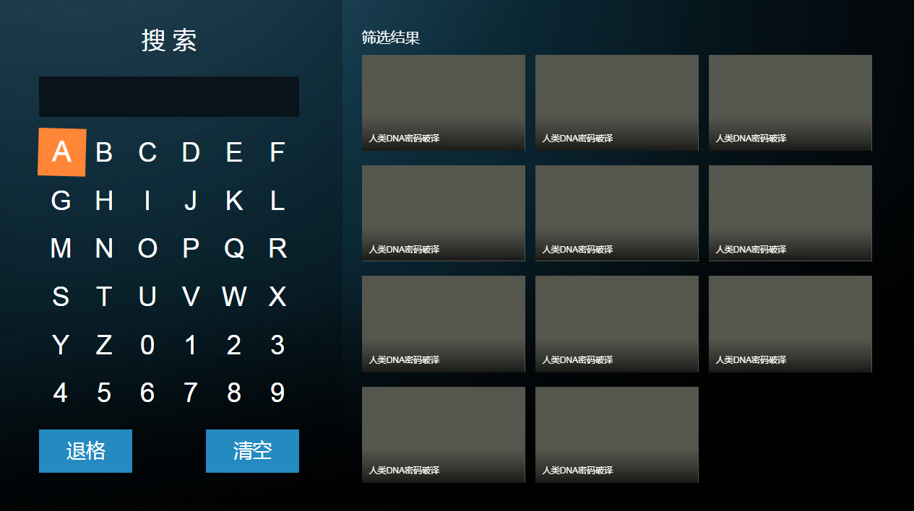

# auto-keyborad


## 概要

这是一个半自动化的键盘访问解决方案，主要适用于需要完全键盘操作场景，比如大屏展示，电视，游戏菜单等，大大简化按键操作的逻辑。

焦点使用虚拟交掉，也就是通过添加`.focus`等class实现，而不是原生自带的`:focus`，更利于定制化需求。

基于`HTML`页面。

## 半自动化

由于实际场景复杂多样，过于全反而会让业务代码更繁杂。

该功能插件仅针对于局部实现自动化操作，整体页面布局仍需开发者手动协调。

具体是指开发者需要手动讲页面分为几块逻辑区域，比如下方的键盘区和搜索列表区。



然后对每块区域分别调用`new View()`即可

```html
<div class="search_keyborad" id="search">
    <a data-key="A">A</a>
    <a data-key="B">B</a>
    ...
</div>
<ul class="search_list" id="list">
    <li class="search_item">
        
        <h3>人类DNA密码破译</h3>
    </li>
    ...
</ul>
<script type="text/javascript" src="./js/smoothscroll.min.js"></script>
<script type="text/javascript" src="./js/base.js"></script>
<script type="text/javascript" src="./js/view.js"></script>
```

```js
var S = $('search');	
var L = $('list');
var V = new View(S);
var Vl = new View(L);
V.init(S.getElementsByTagName('a'));
Vl.init(L.getElementsByTagName('li'));
V.onfocus();
```

这样，每块区域的按键都已经自动适配了。

## API

通过`new View(#container)`适配的区域，可获焦元素可以是常见的`n*m`分布，也可以是绝对定位的任意布局。

通过`V.init(children)`来初始化可获焦子元素，传入`nodeList`即可，与页面层级无关。

### new View(container)

核心方法。创建一个区域，传入参数为页面的一个容器。

```js
var con = document.getElemetById('con');
var V = new View(S);
```

### V.init(nodeList)

初始化，传入参数为需要获焦的子元素，通常使用`getElementsByTagName`来一次性传入多个。

该方法需要等待页面加载完全后使用，也就是说当动态加载网络数据时，需等待只元素加入容器之后调用

```js
V.init(S.getElementsByTagName('a'));

//动态数据
ajax({
    url:'XXX',
    sunccess:function(data){
        var html = '';
        for(var i=0;i<data.length;i++){
            html+='<a>'+data[i]+'</a>';
        }
        S.innerHTML = html;
        V.init(S.getElementsByTagName('a'));
    }
})
```

可以传空。此时表示该区域里面没有可获焦元素，常见场景为新闻类，此时该区域可以自动实现上下浏览的功能。

### V.insertAfter(nodeList)

向后追加子元素。常见场景为上拉加载，追加下一页等功能。

```js
ajax({
    url:'XXX',
    sunccess:function(data){
        var html = '';
        for(var i=0;i<data.length;i++){
            html+='<a>'+data[i]+'</a>';
        }
        M.innerHTML = html;
        V.insertAfter(M.getElementsByTagName('a'));
    }
})
```

### V.insertAfterBefore(nodeList)

与`insertAfter`相反，向前追加子元素。

### V.onfocus()

主动聚焦，当有多个区域时，可选择控制。

```js
var V = new View(S);
V.onfocus();
```

### Calback

这一部分是对按键的回调

#### V.ok

回车、确定。

```js
Vi.ok = function(item){
    console.log(item)//当前获焦元素的dom节点
}
```

当按下确定时，会给当前获焦元素添加`pressIn`类，抬起时移除，可自定义按下效果。

#### V.left、V.right、V.up、V.down

向左/右/上/下（处于边界时）。当获焦元素处于区域边界时触发。一般用于跨越区域。

```js
Vl.left = function(){
    V.onfocus();//此时Vl会自动失去焦点，V会主动获焦
}
```

当处于边界时，如果没有指定触发回调，比如`V.left`，会给当前获焦元素添加`shake`类，这是一个颤抖动画，300ms自动移除。

#### V.back

返回。当按返回键时触发。

#### V.move

移动时触发，回调参数为移动之前的元素，和移动之后的元素。

```js
V.move = function (prev, current) {
    //prev移动之前
    //current移动之前后
}
```

### props

#### V.saveCurrent

是否保留当前状态，类名为`current`。一般用作`tab`切换时跟随。默认为`false`。

#### V.saveCurrentDelay

是否保留当前状态，类名为`current`。一般用作`tab`切换时跟随，但是需要点击ok触发。默认为`false`。

#### V.scrollAnimate

是否启用滚动动画。该功能使用`smoothscroll.js`完成，如果不支持该插件，可禁用滚动动画。

## 案例

[https://portal.codelabo.cn/](https://portal.codelabo.cn/)

> 接口已失效，可查看源代码

## 结语

目前市面上并没有什么对键盘操作封装的库，希望能够帮助大家吧。